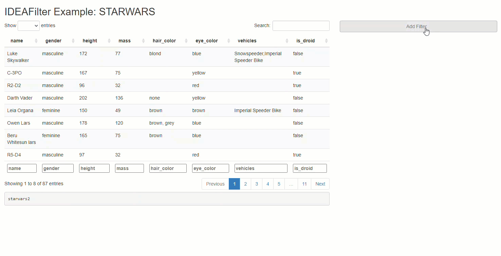

# IDEAFilter 

Agnostic, Idiomatic Data Filter Module for Shiny.

<center>
<a href="https://bit.ly/demo_IDEAFilter">

</a>
</center>

<br>

```{r, echo=FALSE}

```

## Overview

When added to an existing shiny app, users are able to subset any developer-chosen R data.frame on the fly. Specifically, users will be able to slice & dice the data source by applying multiple (order specific) filters using the AND (&) operator between each, and getting real-time updates on the number of rows effected/available along the way. Thus, any downstream processes that use this data (like tables, plots, or statistical procedures) will update after each new filter is applied. The shiny module's UI has an intentionally "minimalist" aesthetic so that the focus can be on the data & other visuals presented in the application.

Note that besides returning a submitted reactive data frame, `IDEAFilter` as also returns the `dplyr::filter()` statements used to slice the data.

### Origins

`IDEAFilter` is built upon the shoulders of giants. Specifically, it's only a slightly modified version of [shinyDataFilter](https://github.com/dgkf/shinyDataFilter), which was built on on top of [Joe Cheng](https://github.com/jcheng5)'s excellent [R/Pharma 2018 shiny demo](https://github.com/jcheng5/rpharma-demo). This package exists in it's current state primarily to meet the needs of [tidyCDISC](https://github.com/Biogen-Inc/tidyCDISC), a shiny app designed for exploratory analysis and reporting of clinical (pharma) data.

## Getting started

### Installation

```{r, eval=FALSE}
# Install from CRAN
install.packages("IDEAFilter")

# Or install latest dev version from github using devtools
devtools::install_github("Biogen-Inc/IDEAFilter")
```

### Usage

After installation, you now have access to the`IDEAFilter` shiny module. On the UI side, you need only include the following line of code to place the filtering widget somewhere in your app:

```{r, eval=FALSE}
shiny_data_filter_ui(inputId = "data_filter")
```

The server side logic needs to call the `shiny_data_filter` module, match the input ID from the UI, and provide a data source. The returned reactive data.frame (called "filtered_data") may used for downstream processes regardless on if the user chooses to apply filters or not.

```{r, eval=FALSE}
filtered_data <- # name the returned reactive data frame
   callModule(
     shiny_data_filter, # call the module by name
     "data_filter",     # give the filter a name(space)
     data = starwars2,  # feed it raw data
     verbose = FALSE
    )
```

### Example App

Copy & paste the code below into a live R session to see the inner workings of the Star Wars app referenced above. Or click the button below to test drive the example app now!

<center>
<a href="https://bit.ly/demo_IDEAFilter">

</a>
</center>

<br>

```{r, eval=FALSE}
library(shiny)
library(IDEAFilter)
library(dplyr)  # for data pre-processing and example data
 
# prep a new data.frame with more diverse data types
starwars2 <- starwars %>%
 mutate_if(~is.numeric(.) && all(Filter(Negate(is.na), .) %% 1 == 0), as.integer) %>%
 mutate_if(~is.character(.) && length(unique(.)) <= 25, as.factor) %>%
 mutate(is_droid = species == "Droid") %>%
 select(name, gender, height, mass, hair_color, eye_color, vehicles, is_droid)

# create some labels to showcase column select input
attr(starwars2$name, "label")     <- "name of character"
attr(starwars2$gender, "label")   <- "gender of character"
attr(starwars2$height, "label")   <- "height of character in centimeters"
attr(starwars2$mass, "label")     <- "mass of character in kilograms"
attr(starwars2$is_droid, "label") <- "whether character is a droid"

ui <- fluidPage(
 titlePanel("{IDEAFilter} Example: Star Wars App"),
 fluidRow(
   column(8, 
     dataTableOutput("data_summary"),
     h4("Generated Code"),
     verbatimTextOutput("data_filter_code")),
   column(4, shiny_data_filter_ui("data_filter"))))

server <- function(input, output, session) {
  
  
 filtered_data <- # name the returned reactive data frame
   callModule(
     shiny_data_filter, # call the module
     "data_filter",     # give the filter a name(space)
     data = starwars2,  # feed it raw data
     verbose = FALSE
    )
 
 # extract & display the "code" attribute to see dplyr::filter()
 # statements performed
 output$data_filter_code <- renderPrint({
   cat(gsub("%>%", "%>% \n ", 
     gsub("\\s{2,}", " ", 
       paste0(
         capture.output(attr(filtered_data(), "code")), 
         collapse = " "))
   ))
 })
 
 # View filtered data
 output$data_summary <- renderDataTable({
   filtered_data() 
 }, 
 options = list(
   scrollX = TRUE,
   pageLength = 8
 ))
 
}
 
shinyApp(ui = ui, server = server)
```