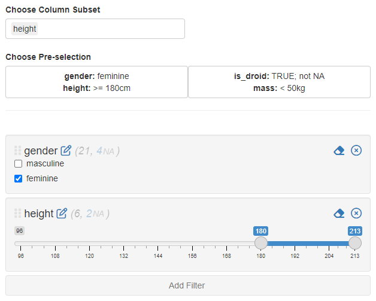

```{r, include = FALSE}
knitr::opts_chunk$set(
  collapse = TRUE,
  comment = "#>"
)
```

# Minimal Example

Here is a minimal example using `IDEAFilter_ui()` and `IDEAFilter()` to explore a data set:

```{r, eval=FALSE}
library(shiny)
library(IDEAFilter)
library(dplyr)
shinyApp(
  ui = fluidPage(
    titlePanel("Filter Data Example"),
    fluidRow(
      column(8, dataTableOutput("data_summary")),
      column(4, IDEAFilter_ui("data_filter")))),
  server = function(input, output, session) {
    filtered_data <- IDEAFilter("data_filter", data = iris, verbose = FALSE)
    output$data_summary <- 
      renderDataTable(filtered_data(), 
    options = list(scrollX = TRUE, pageLength = 5))
  }
)
```

The server side of the module returns the reactive `ShinyDataFilter_df` object which includes the filtered data frame and the code used to filter it as an attribute.

# A Larger Example

With the release of `IDEAFilter()` to replace the deprecated `shiny_data_filter()`, a couple more arguments have been introduced to enhance the functionality of the filter.

-   Column Sub-setting: restricting the columns a user can add to the filter.
-   Pre-selection: pre-specifying a collection of filters to either pre-load in the filter or for users to dynamically apply.

To explore these features we can run the following example application:

```{r, eval=FALSE}
library(shiny)
library(IDEAFilter)
app <- system.file("examples", "starwars_app", package = "IDEAFilter")
runApp(app)
```

## Column Sub-setting

In the application you can freely select a subset of columns to include in the filter. The `col_subset` argument can be set in development of an application or can be a reactive variable in deployment. You should note these columns can still be set using pre-selection and will still be applied to the filter. For instance, you can see below that only `height` has been selected but `gender` is still being applied.

{style="position:center; width:100%"}

## Pre-selection

The application comes with two choices to apply pre-selection:

-   Gender listed as feminine and height greater than 180 cm
-   Character is a droid (excluding `NA`s) and has a mass less than 50 kg

Looking at the second example is informative on how a developer can create their own pre-selections.

```{r, eval=FALSE}
list(
  is_droid = list(filter_na = TRUE, filter_fn = ~ isTRUE(.x)),
  mass = list(filter_fn = ~ .x < 50))
)
```

The argument `preselection` is a named list where the names correspond to column names in the data set and the elements are lists containing the elements `filter_na` and `filter_fn`. The missing values (i.e. NAs) will be filtered if `filter_na` is set to `TRUE`. The `filter_fn` element can either be a formula or a function. The filter will attempt to apply the function to the data set when populating the initial values.
